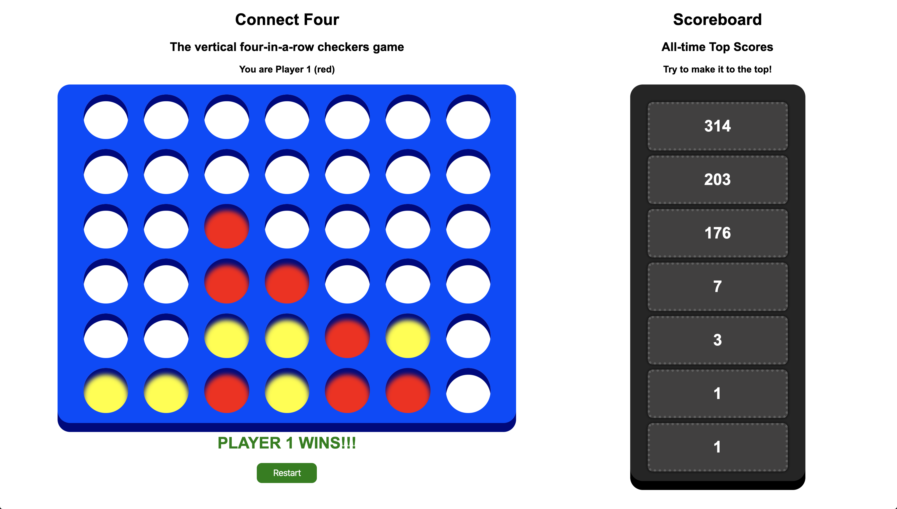

# **Connect Four**

## The vertical four-in-a-row checkers game!

[Video demonstration](https://youtu.be/Vbit9OEQLb8)

React | Node | Express | MySQL

The vertical four-in-a-row checkers game

- Implemented game logic for horizontal, vertical, and diagonal wins
- Used event delegation for clicks and maintained 2D matrix in state
- Persisted current score and top scores with PUT and GET endpoints

